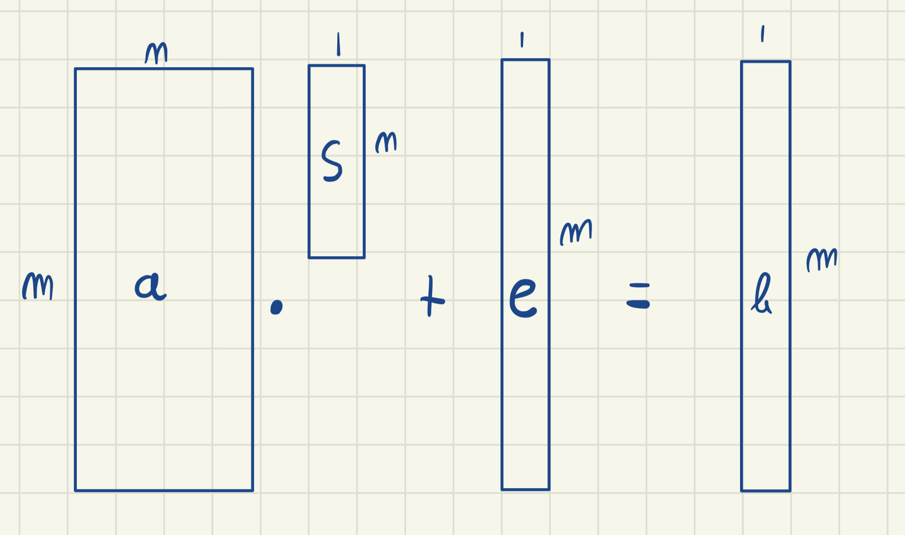

# lwe-rlwe
python implementation of Learning With Errors Problem and Ring Learning With Errors Problem

Based on https://medium.com/asecuritysite-when-bob-met-alice/learning-with-errors-and-ring-learning-with-errors-23516a502406

# LWE

Learning with Errors (and Ring Learning With Errors) is a quantum resitant cryptographic technique associated with Lattice-based Cryptography.

- a is a random matrix (public)
- s is a secret vector 
- e is a error vector - also known as noise vector
- b is the result vector of $b_{i} = a_{i}*s + e_{i}$  (public)

The notation $\mathbb{Z}_{13}$ indicates that we are operating in a finite field of integer elements with modulo 13.


Noisy modular equation are really hard to solve. For an external observer that only knows vector a and b, it is hard to find s because:
- Of the noise e
- The modulo operation



```
python3 lwe.py
```
 
- Note that we should be careful when defining the parameters that define an LWE algo. These parameters are `m`, `n`. `q` (which is the modulo prime) and B. [-B, B] is the distribution from which the elements of the error vector are sampled. B should be small.
These parameters define how difficult is to solve the LWE problem.

### LWE Encryption

In the context of LWE public key encryption, the secret matrix s is the private key and the A, B matrices are the public key. The message is a single bit M.

- $u = \left(\sum aSamples\right) \bmod Q$
- $v = \left(\sum bSamples\right) + \frac{q}{2}M\bmod Q$

The ciphertext is (u, v)

[LWE Encryption](https://asecuritysite.com/encryption/lwe2)

- $Dec = v - su \bmod Q$

If the decrypted message is less than $\frac{q}{2}$, then the message is 0, otherwise it is 1.

```
python3 lwe_enc.py
```

# RLWE

The main difference is that in RLWE we deal with polynomials instead of matrices.


It is important to note that the polynomials are in the ring $\mathbb{Z}_q[x]/(x^n + 1)$ where n is 1+ the max degree of the polynomials. 

The notation $\mathbb{Z}_q[x]/(x^n + 1)$ indicates that: 

- We are operating in a polynomial ring
- The ring contains all the polynomials with coefficients which are integers modulo q
- The polynomial $x^n + 1$ is the "modulus" of the ring. It means that for every polynomial $f(x)$ in the ring, $f(x) * (x^n + 1) = 0 \bmod  x^n + 1$.
- In practice, it means that when we are performing operations on the polynomials:
    - We perform the operations normally
    - We need to reduce the coefficients modulo q
    - We need to reduce the resulting polynomials modulo $x^n + 1$. It means that we need to divide the resulting polynomial by $x^n + 1$ and keep the remainder.


Each operation that we do on the polynomials is divided by the polynomial $x^n + 1$. This is sort of a modulo operation.

$b = a*s + e$

### Questions 

- [ ] What are the requirement in the dimensions of the matrix? Are we actually dealing with a matrix or a vector?
- [ ] How do I perform the sampling for a matrix in the encryption function for LWE?
